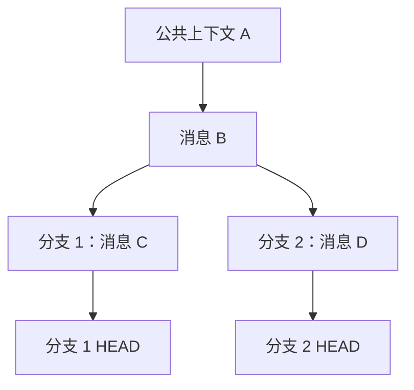
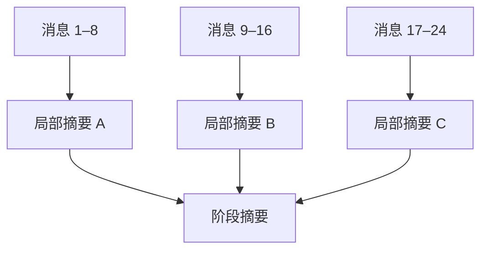

> 分支在逻辑上像“复制上下文”，在物理存储上绝不能真的复制。

真正适合的实现是 Git 式不可变 DAG：创建分支时只增加一个指针，成本接近 (O(1))。



当模型位于分支 1 时，后端沿父指针重建：

```text
A → B → C → E
```

它自然看不到分支 2，而数据库里 `A、B` 只保存一次。

## 基础数据模型

```sql
conversation_node
- id
- parent_id          -- 普通节点只有一个父节点
- role
- content_blob_hash  -- 内容寻址
- token_count
- summary_id
- created_at

branch
- id
- name
- head_node_id
- base_node_id

content_blob
- hash               -- SHA-256(content)
- compressed_content
- codec               -- zstd
- reference_count
```

创建分支实际只是：

```ts
const branch = {
  baseNodeId: currentNode.id,
  headNodeId: currentNode.id,
};
```

不复制任何历史消息。

## 真正需要解决的是两种“大小”

### 1. 磁盘存储大小

这部分相对容易：

* 公共祖先只存一次
* 消息不可变，以哈希作为内容地址
* 相同内容自动去重
* 正文使用 Zstd 压缩
* 图片、PDF等附件放对象存储，只保存引用
* Embedding 单独存储，可重新生成
* 路径快照属于缓存，可以随时删除重建

自然语言本身的磁盘占用通常不是最大问题。真正容易膨胀的是附件、向量、重复快照和模型调用日志。

### 2. 模型上下文大小

这才是核心难题。即使数据库只保存一次，调用模型时也不能无限将 `root → HEAD` 的完整路径塞进上下文。

应该维护三层信息：

| 层级   | 保存内容          | 进入模型的方式  |
| ---- | ------------- | -------- |
| 原始历史 | 完整对话，不丢失      | 需要回溯时加载  |
| 分层摘要 | 每一段对话的压缩表示    | 默认进入上下文  |
| 工作记忆 | 当前目标、结论、疑问、术语 | 每次调用优先进入 |

实际构建的上下文可以是：

```text
系统指令
+ 项目目标
+ 远古祖先的层级摘要
+ 当前分支摘要
+ 最近 6～12 条原始消息
+ 显式引用的其他节点
+ 当前用户输入
```

而不是整条历史。

## 分层摘要比单一摘要更可靠

不要反复覆盖一个越来越短的 `summary`，否则会不断丢失信息。可以建立摘要树：



每个摘要还应是结构化的：

```json
{
  "goal": "理解自注意力机制",
  "established_facts": [
    "Q 表示查询",
    "K 表示匹配依据",
    "V 表示被聚合的信息"
  ],
  "user_understanding": {
    "QKV": "understood",
    "scaled_dot_product": "uncertain"
  },
  "open_questions": [
    "为什么除以 sqrt(d_k)"
  ],
  "important_node_refs": ["node_182", "node_194"]
}
```

这样模型需要细节时，可以根据 `node_ref` 回源，而不是只能相信一段有损摘要。

## 合并分支也不应复制历史

合并节点可以有两个父引用，但进入主线的通常只是一份“合并产物”：

```json
{
  "source_branch": "qkv",
  "target_branch": "attention",
  "conclusion": "QKV 分别负责查询、匹配与信息聚合",
  "resolved_questions": ["QKV 分别有什么作用"],
  "remaining_questions": ["缩放因子的数学意义"],
  "evidence_nodes": ["node_182", "node_187"]
}
```

因此，整个系统可以概括为：

[
\text{物理存储}
===========

\text{不可变消息 DAG}
+
\text{内容去重}
+
\text{压缩 Blob}
]

[
\text{推理上下文}
============

\text{祖先摘要}
+
\text{当前分支记忆}
+
\text{近期原文}
+
\text{按需检索节点}
]

所以最难的并非“压缩聊天文本”，而是：

> 在不破坏结论来源、概念关系和用户认知状态的前提下，判断哪些信息必须逐字保留，哪些可以摘要，哪些可以临时不加载。

这会成为产品真正的后端壁垒：不是上下文隔离本身，而是可回溯的有损压缩与动态上下文编译。
