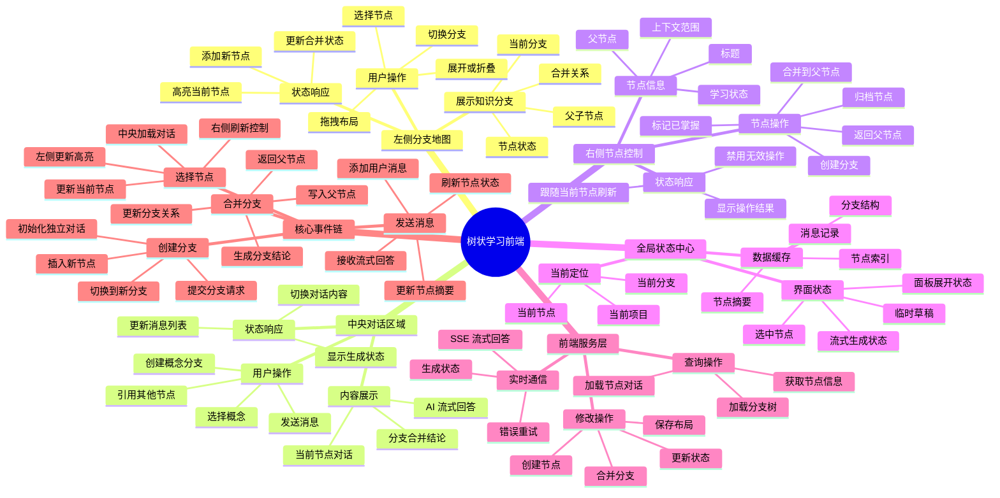
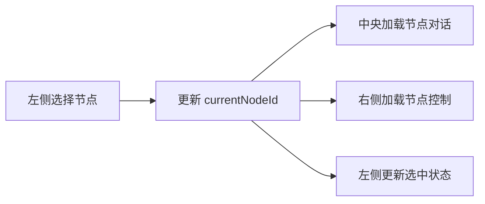

## 前端交互关系思维导图



最关键的设计原则是：

> 左、中、右三个区域不直接互相控制，而是共同读写“当前节点状态”。

例如用户在左侧选择节点后：



推荐用 Zustand 管理这种状态：

```ts
type WorkspaceState = {
  currentProjectId: string;
  currentBranchId: string;
  currentNodeId: string;

  nodes: Record<string, Node>;
  branches: Record<string, Branch>;
  messages: Record<string, Message[]>;

  selectNode: (nodeId: string) => void;
  createBranch: (sourceNodeId: string) => Promise<void>;
  mergeBranch: (branchId: string) => Promise<void>;
  updateNodeStatus: (nodeId: string, status: NodeStatus) => void;
};
```

这样整个前端的交互主轴就是：

**左侧负责定位 → 中央负责学习 → 右侧负责操作 → 全局状态负责同步。**
